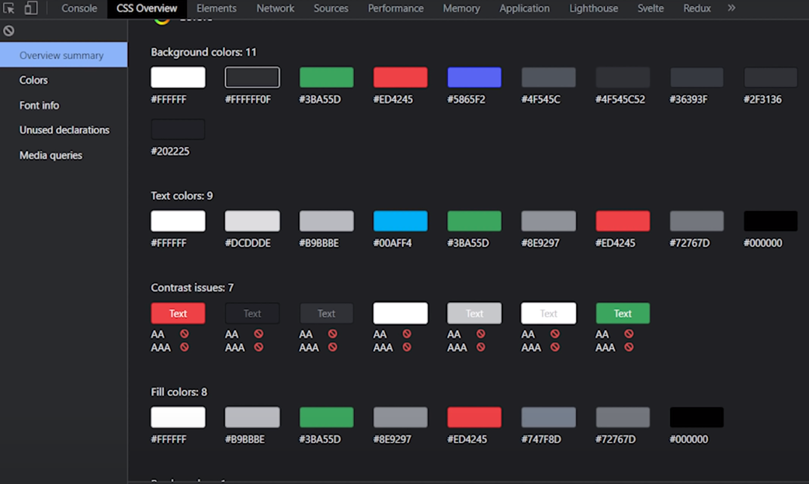

## Step 1
Generate project with JavaScript Framework.

**React** - View - Angular - Svelte
we're using react yesssuh

install react package

install tailwind
`npm install -D tailwindcss@npm:@tailwindcss/postcss7-compat postcss@^7 autoprefixer@^9`

install craco


replace the 
```
"scripts": {
    "start": "react-scripts start",
    "build": "react-scripts build",
    "test": "react-scripts test",
    "eject": "react-scripts eject"
  },
```
to craco
update your scripts in your package.json file to use craco instead of react-scripts for all scripts except eject:

create cracko config file..
`craco.config.js`

add tailwindcss and autoprefixer as PostCSS plugins


`npx tailwindcss-cli@latest init`
creates `tailwind.config.js` config at the root of the project

replace `./src/index.css`
with a couple things

and finally 
`npx start`
to get the project running.

also have to setup 
(Just In Time))
` mode:'jit',`
tailwind.config.js
Compiles CSS on the fly and makes build times much faster..

also purge unused css

```
purge: [
    './src/**/*.html',
    './src/**/*.vue',
    './src/**/*.jsx',
    './public/index.html'
  ]
```
Unused anything purged.
If this was getting deployed it would allow very small css file sizes.


[clippy css](https://bennettfeely.com/clippy/)
found this cool CSS svg clipper site


for some reason the purge on `tailwind.config.js`? Apparently me missing out the .js file completely screwed it over...

so be sure to include 
    `'./src/**/*.js',`
    bruh moment fr

```
extend: {
      colors: {
        primary: '#202225',
        secondary: '#5865f2',
        tertiary: '#5865f2',
      }
    },
```
added this to keep consistent w/ the discord theme.


And Apparently Chrome Dev Tools
`CSS Overview`




had to add 
`const colors = require('tailwindcss/colors')`
to tailwind.config.js

now we adding icons from a package called 
`react-icons`

you import them from their corresponding
`react-icons/{key}`


instead of utilizing a utility class, we're using 
`sidebar-icon` in `SideBar.js`
but that class is built using tailwind.


Now we're wondering how to change state during 
events

hover and focus and shit


Now we work on transition animation
goes from rounded to squirqle
`index.css`


### Animated Tooltip
`SideBar.js` another prop along w {icon}

you can't hover over invis elements
this is where we use groups, but groups don't apply very well in `@apply`


### Dark Mode.
super ez to implement
2 ways to go about it
- media (prefers color scheme from the browser)
- class

looks for `dark` class in any parents

custom react hook to manage user preference and use local storage